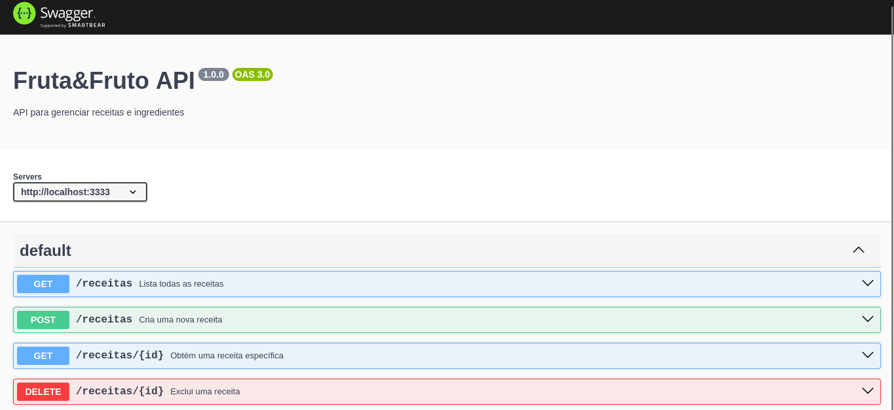
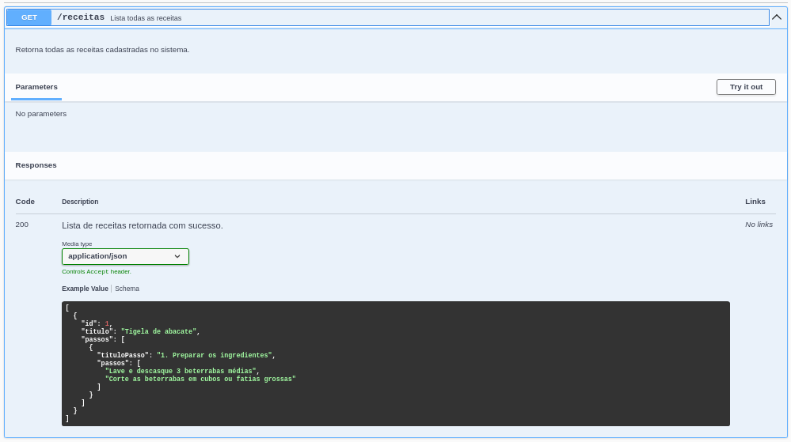
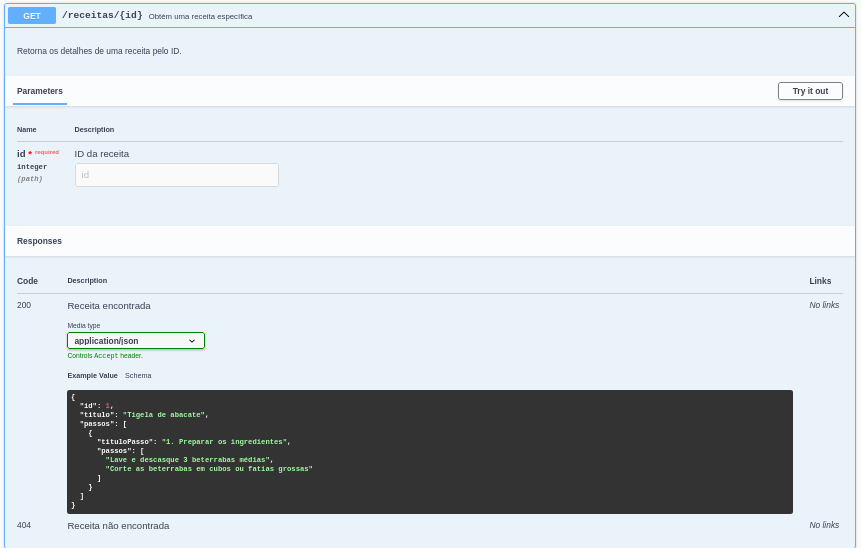
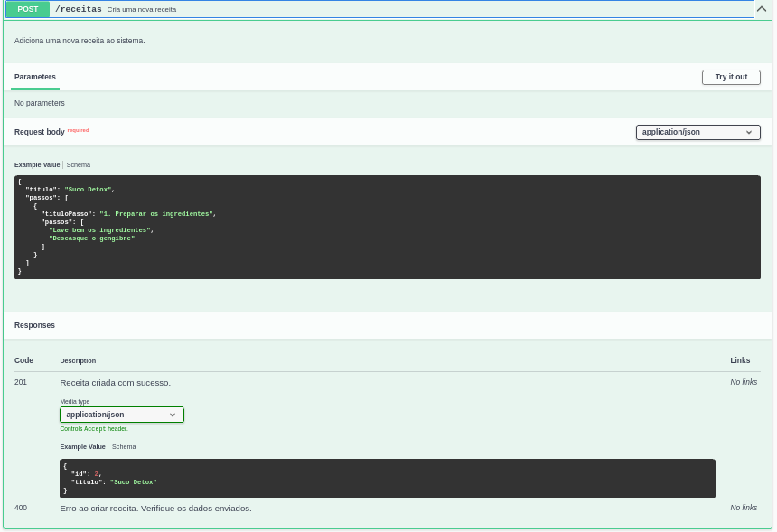
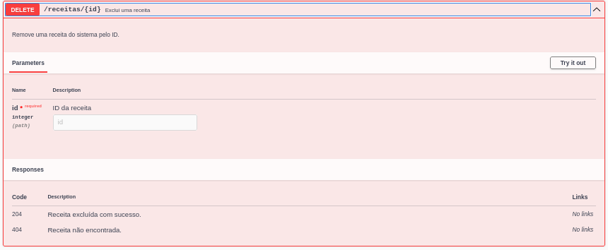

# Fruta&Fruto API 🍏🍓

API para gerenciar receitas.

## 🔧 Tecnologias
- Node.js
- Express
- TypeORM
- PostgreSQL

## ⚙️ Requisitos
Antes de começar, você precisa ter instalado:

- Node.js (versão 18.20.7 ou superior)
- PostgreSQL

## 👾 Setup do Projeto

### 📌 1. Clone o repositório
git clone https://github.com/seu-repo/frutaefruto-api.git
cd frutaefruto-api

### 🐘 2. Configuração do Banco de Dados
No arquivo setup.sh ou setup.bat insira seu usuário e senha do postgresql 

#### Se estiver no MacOS ou Linux, rode os seguintes comandos: 
- chmod +x setup.sh
- ./setup.sh

#### Se estiver no Windows, rode o comando: 
- ./setup.bat
  
### 🖥 3. Configuração do Ambiente

1. Renomeie o arquivo `.env.example` para `.env`
2. Preencha os valores das variáveis de ambiente:

## 🚀 Iniciando o projeto
npm run dev:server

## 🔥 Endpoints principais
A api também foi documentada com Swagger. Aqui estão os principais endpoints: 

### 📌 Swagger Docs

### 📌 Listar receitas
GET /receitas **Retorna todas as receitas cadastradas.**

### 📌 Buscar receita por ID

GET /receitas/:id **Retorna os detalhes da receita com o ID fornecido.**

### 📌 Criar receita
POST /receitas **Cria uma nova receita e o passo a passo de preparo**

### 📌 Deletar receita
DELETE /receitas/:id **Remove uma receita com base no ID.**

